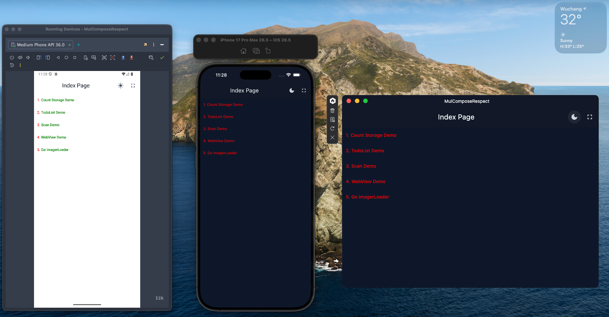

# MulComposeRespect

A Kotlin Multiplatform project built with Compose Multiplatform.

This repository is used to explore and integrate common features for modern cross-platform
applications, including Android, iOS, Desktop, and Web-related development scenarios.

The project demonstrates how to combine Compose UI, dependency injection, navigation, networking,
local storage, image loading, barcode scanning, WebView, theme switching, fullscreen control, and
other useful multiplatform capabilities in one application.

## Features

* Kotlin Multiplatform project structure
* Compose Multiplatform UI
* Material 3 design components
* Cross-platform navigation
* Koin dependency injection
* Koin ViewModel integration
* Ktorfit-based API requests
* Kotlinx Serialization
* DataStore-based local storage
* Snackbar and toast message support
* Dark mode switching
* Fullscreen / system style control
* Barcode / QR code scanning demo
* WebView demo
* Coil image loading demo
* SVG image loading support
* CSS-like color parsing support
* Logging with Kermit

## Demo Pages

The home page currently includes the following demo entries:

1. **Count Storage Demo**
   Demonstrates local state and storage usage.

2. **TodoList Demo**
   Demonstrates API requests, list rendering, form interaction, and CRUD-related UI logic.

3. **Scan Demo**
   Demonstrates barcode / QR code scanning.

4. **WebView Demo**
   Demonstrates loading web content inside the application.

5. **ImageLoader Demo**
   Demonstrates image loading, caching, SVG support, and network image rendering.

## Tech Stack

### Core

* Kotlin Multiplatform
* Compose Multiplatform
* Compose Runtime
* Compose Foundation
* Compose Material 3
* Compose Resources
* Compose UI Tooling Preview

### Architecture

* Koin
* Koin Annotations
* Koin Compose
* Koin ViewModel
* AndroidX Lifecycle ViewModel Compose
* AndroidX Lifecycle Runtime Compose

### Navigation

* Compose Navigation

### Networking

* Ktorfit
* Ktor Client Core
* Ktor Client Logging
* Ktor Content Negotiation
* Kotlinx Serialization JSON

### Local Storage

* AndroidX DataStore
* AndroidX DataStore Preferences

### UI Utilities

* Material Icons Extended
* Compose Sonner
* Kermit Logger

### Media and Platform Features

* KScan
* Compose WebView Multiplatform
* Coil Compose
* Coil Ktor3 Network
* Coil SVG

### Color Utilities

* Colormath
* Colormath Jetpack Compose Extension

## Project Structure

The project follows a Kotlin Multiplatform structure and separates shared logic from
platform-specific implementations.

Common shared code contains:

* UI screens
* ViewModels
* Routing
* API service definitions
* Storage abstraction
* Theme state
* System style abstraction
* Reusable utilities

Platform-specific code is used where native behavior is required, such as fullscreen handling,
system bars, storage paths, WebView integration, and scanner permissions.

## Effect



## Home Screen Example

The home screen uses Compose `Scaffold`, `TopAppBar`, `LazyColumn`, and route-based demo entries.

It also includes:

* Dark mode toggle
* Fullscreen toggle
* Snackbar message host
* Navigation to demo pages

```kotlin
val listCom: List<RouterList> = listOf(
    RouterList(Routes.Count.route, "Count Storage Demo"),
    RouterList(Routes.TodoList.route, "TodoList Demo"),
    RouterList(Routes.Scan.route, "Scan Demo"),
    RouterList(Routes.WebView.route, "WebView Demo"),
    RouterList(Routes.ImageLoader.route, "Go ImagerLoader"),
)
```

## Running the Project

### Android

Open the project in Android Studio and run the Android application module.

You can also build from the command line:

```bash
./gradlew :app:androidApp:assembleDebug
```

### iOS

Open the iOS application module with Xcode and run it on a simulator or a real device.

Generate and open the Xcode project:

```bash
./gradlew :app:iosApp:iosDeployIPhoneSimulatorDebug
```

### Desktop

Run the normal desktop application:

```bash
./gradlew :app:desktopApp:run
```

For Compose Hot Reload:

```bash
./gradlew :app:desktopApp:hotRunJvm --auto
```

If you want to run the desktop app with the KCEF WebView entry point, use the custom Gradle task:

```bash
./gradlew :app:desktopApp:runWebView
```

The `runWebView` task uses a separate desktop main class for WebView/KCEF startup:

```kotlin
tasks.register<JavaExec>("runWebView") {
    group = "application"
    description = "Run desktop app with KCEF WebView main"

    mainClass.set("com.djx.mulcomposerespect.WebViewMainKt")

    classpath = sourceSets["main"].runtimeClasspath

    jvmArgs(
        "--enable-native-access=ALL-UNNAMED",
        "--add-opens", "java.desktop/sun.awt=ALL-UNNAMED",
        "--add-opens", "java.desktop/java.awt.peer=ALL-UNNAMED",
        "--add-opens", "java.desktop/sun.lwawt=ALL-UNNAMED",
        "--add-opens", "java.desktop/sun.lwawt.macosx=ALL-UNNAMED"
    )
}
```

This task is useful when the desktop WebView runtime requires extra JVM arguments, especially when
running KCEF on macOS.

### Web

Web support is currently limited because the shared module uses AndroidX DataStore, which is not
available for the current JS/Wasm source set configuration in this project.

If Web support is needed again, the storage layer should be separated with platform-specific
implementations for Android/JVM/iOS and JS/Wasm.

Example command when Web support is enabled:

```bash
./gradlew :app:webApp:jsBrowserDevelopmentRun
```

## Notes

This project is mainly used as a practical Kotlin Multiplatform playground.

Some features may require platform-specific configuration, for example:

* Camera permission for scanning
* Network permission on iOS
* Local network access during development
* WebView runtime requirements on Desktop
* Platform-specific fullscreen behavior

## Dependencies

Main libraries used in this project include:

* Compose Multiplatform
* Material 3
* Koin
* Ktorfit
* Ktor Client
* Kotlinx Serialization
* AndroidX DataStore
* KScan
* Compose WebView Multiplatform
* Coil
* Kermit
* Compose Sonner
* Colormath

## License

This project is open source.

Please check the license file for more details.
